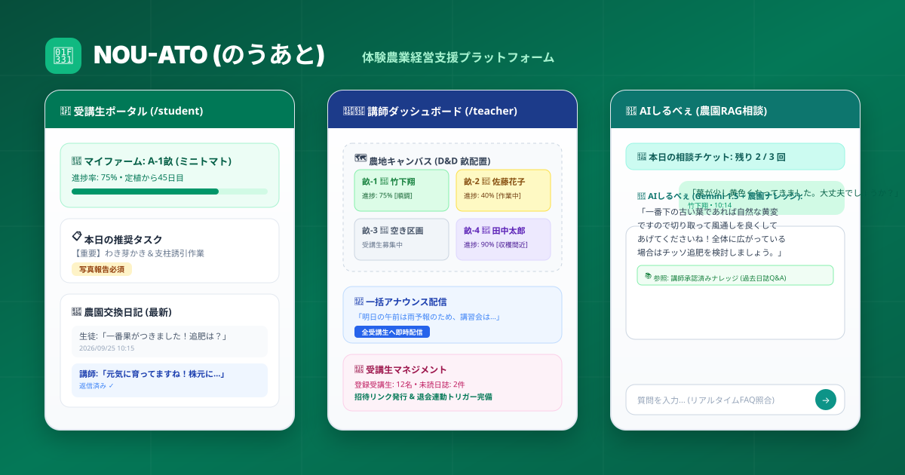

# NOU-ATO (のうあと) - 体験農業経営支援アプリ



「**NOU-ATO（のうあと）**」は、体験農園の運営者（講師）と受講生（生徒）をつなぎ、初心者でも迷わず野菜づくりを楽しみながら学べる体験農業経営支援Webアプリケーションです。

---

## 🌾 プロジェクト概要・特徴

- **受講生向け機能 (Student Portal)**:
  - **マイタスク管理 & 進捗可視化**: 栽培ステップ（土作り、苗植え、芽かき、追肥、収穫など）を段階的にクリア。
  - **農園交換日記（日誌報告）**: 作業報告や写真を投稿し、講師からの個別アドバイスを受信。
  - **AI相棒「しるべぇ」相談**: 農園の蓄積ノウハウ（RAG）を活用し、自然栽培のコツをいつでも相談（1日3回チケット制・深夜0時自動復活・秘密の呪文対応）。
- **講師向け機能 (Teacher Dashboard)**:
  - **受講生・区画マネジメント**: 受講生ごとの進捗率、割り当て畝（農地キャンバス）、未読日誌を一元把握。
  - **一括アナウンス配信**: 天候不良や収穫イベントの連絡を受講生全員へ即時配信。
  - **農地キャンバス（畝・区画管理）**: ドラッグ＆ドロップやステータス管理で畝の栽培状況をグラフィカルに管理。

---

## 🌐 デモ環境 & アクセス情報

| 環境 | URL | 備考 |
| :--- | :--- | :--- |
| **本番デモ環境** | [https://nou-ato.vercel.app](https://nou-ato.vercel.app) | Vercel Edge Network 稼働中 |
| **ローカル開発環境** | [http://localhost:3000](http://localhost:3000) | `npm run dev` で起動 |
| **API 仕様 (Swagger UI)** | [`docs/api-docs.html`](docs/api-docs.html) | ブラウザから直接各APIを検証可能 |

### 動作確認用デモアカウント
| ロール | 画面URL | 目的・確認可能機能 |
| :--- | :--- | :--- |
| **講師 (Teacher)** | `/teacher/dashboard` | 受講生一覧、進捗率、日誌返信、農園キャンバス、一括配信 |
| **受講生 (Student)** | `/student` | マイタスク確認、日誌報告、AIしるべぇチャット相談、区画確認 |
| **招待・参加** | `/invite` | 新規受講生の農園参加フロー |

---

## 🛠️ 技術スタック

| レイヤー | 採用技術 |
| :--- | :--- |
| **フロントエンド** | Next.js 16 (App Router), React 19, TypeScript |
| **スタイリング** | Tailwind CSS v4, Lucide Icons |
| **状態管理・D&D** | Zustand, @dnd-kit (Core, Sortable, Modifiers) |
| **バックエンド / DB** | Supabase (PostgreSQL, Supabase Auth, SSR, Storage, RLS) |
| **AI / RAG** | Google AI Studio (Gemini 1.5 Flash-Lite), 農園ナレッジ類似度照合エンジン |
| **API アーキテクチャ** | OpenAPI 3.1, RFC 7807 (Problem Details), Swagger UI |
| **CI / CD** | GitHub Actions (Lint, Typecheck, Test, Coverage, Build) |
| **テストフレームワーク** | Vitest, @vitest/coverage-v8 (閾値 70% 準拠) |

---

## 🚀 環境構築 & ローカル起動手順

### 1. 前提条件
- Node.js `v20` 以上 (推奨: `v24` 以上)
- npm `v10` 以上

### 2. リポジトリのクローンと依存関係インストール
```bash
git clone <repository-url>
cd nou-ato
npm install
```

### 3. 環境変数の設定
プロジェクトルートに `.env.local` を作成し、必要なキーを設定します：
```env
# Supabase
NEXT_PUBLIC_SUPABASE_URL=https://your-project.supabase.co
NEXT_PUBLIC_SUPABASE_ANON_KEY=your-anon-key

# Google AI Studio (Gemini API)
GEMINI_API_KEY=your-gemini-api-key
```

### 4. 開発サーバーの起動
```bash
npm run dev
```
ブラウザで [http://localhost:3000](http://localhost:3000) を開きます。

---

## 🧪 テスト・品質検証コマンド

本プロジェクトでは品質とセキュリティを担保するため、CI/CD連動のテストスイートを配備しています。

```bash
# 1. 自動テストの実行 (全65件)
npm run test

# 2. テストカバレッジ検証 (目標値 70% 判定)
npm run test:coverage

# 3. TypeScript 型チェック (型エラー0件の検証)
npx tsc --noEmit

# 4. 本番ビルド検証 (Turbopack)
npm run build

# 5. コードスタイル・Lint検証
npm run lint
```

---

## 🗺️ 今後の実装予定機能ロードマップ (Roadmap)

今後のアップデートで以下の機能拡充を予定しています：

1. **💳 Stripe オンライン決済・サブスクリプション連携**:
   - 農園受講料の月額引き落とし、追加AI相談チケット・体験イベント参加費の即時クレジットカード決済。
2. **📲 LINE 公式アカウント Push 通知連携**:
   - 講師からの一括お知らせ配信や、明日の水やりアラート、講師からの日誌返信通知をLINEトーク画面へ即時Push。
3. **📶 PWA (Progressive Web App) & オフライン対応**:
   - 電波の届きにくい畑の現場でも、Service Worker と IndexedDB を用いてオフラインで作業記録や写真を一時保存・電波復旧時に自動同期。
4. **🌡️ IoT 農業環境センサー連携**:
   - 土壌水分量、地温、日照センサーデータをリアルタイム収集し、AIしるべぇが「本日水やりが必要か」を自動判定してアドバイス。

---

## 📂 ディレクトリ構成

```text
nou-ato/
├── .github/              # GitHub Actions CI/CD パイプライン
│   └── workflows/        # ci.yml (品質ゲート), deploy.yml (ビルド検証)
├── app/                  # Next.js App Router (ルーティング & API)
│   ├── api/              # API Route Handlers (chat, settings)
│   ├── student/          # 受講生ポータル画面
│   ├── teacher/          # 講師ダッシュボード画面
│   └── login/            # 認証・ログイン画面
├── components/           # UIコンポーネント (teacher, student, ui, board)
├── lib/                  # 共通ユーティリティ (RAG, Supabase, TicketManager, logger, apiResponse)
├── test/                 # 自動テストスイート (Vitest: 全65項目)
├── docs/                 # 仕様書・品質ダッシュボード・OpenAPI・ER図
└── types/                # TypeScript型定義 (Database, Supabase)
```

---

## 📑 オリアプレビュー & 品質検証ドキュメント一覧

ブラウザで直接開いて確認・操作できるインタラクティブなHTMLドキュメント群です。各ドキュメント間は上部ナビゲーションタブでシームレスに相互移動できます。

| ドキュメント | ファイルパス | 内容・役割 |
| :--- | :--- | :--- |
| **オリアプレビュー項目DB (全101項目)** | [`docs/review-checklist-dashboard.html`](docs/review-checklist-dashboard.html) | 全101機能・非機能要件の検証ダッシュボード、合否判定、エビデンス集約 |
| **API 仕様書 & Swagger UI** | [`docs/api-docs.html`](docs/api-docs.html) | OpenAPI 3.1 仕様に基づくブラウザ対話型 API ドキュメント |
| **ER図 & テーブル定義書** | [`docs/database-design.html`](docs/database-design.html) | Mermaid ER図、全8テーブルのカラム型・制約・RLSポリシー設計書 |
| **非機能要件定義書** | [`docs/NON_FUNCTIONAL_REQUIREMENTS.md`](docs/NON_FUNCTIONAL_REQUIREMENTS.md) | パフォーマンスSLO、可用性99.9%、セキュリティRLS監査規準 |
| **ログ設計書** | [`docs/LOGGING_DESIGN.md`](docs/LOGGING_DESIGN.md) | 構造化JSONログ、ログレベル、個人情報マスキング規定 |
| **品質検査計画書 (QA Master Plan)** | [`docs/test-plan.html`](docs/test-plan.html) | 全テスト項目と完全同期したテスト計画、自動テスト実行・検証 |
| **アーキテクチャ & データフロー** | [`docs/architecture-map.html`](docs/architecture-map.html) | Next.js 16 + Supabase + Gemini RAG + RLS 認可フロー構造図 |
| **エージェント & スキル活用ガイド** | [`docs/agent-and-skills-guide.html`](docs/agent-and-skills-guide.html) | AI開発エージェントチームの役割分担と自律修正プロトコル解説 |
| **全画面フロー & 仕様マップ** | [`public/screen_flow.html`](public/screen_flow.html) | 講師・受講生の全画面遷移、機能、データ連携使い方完全マップ |
