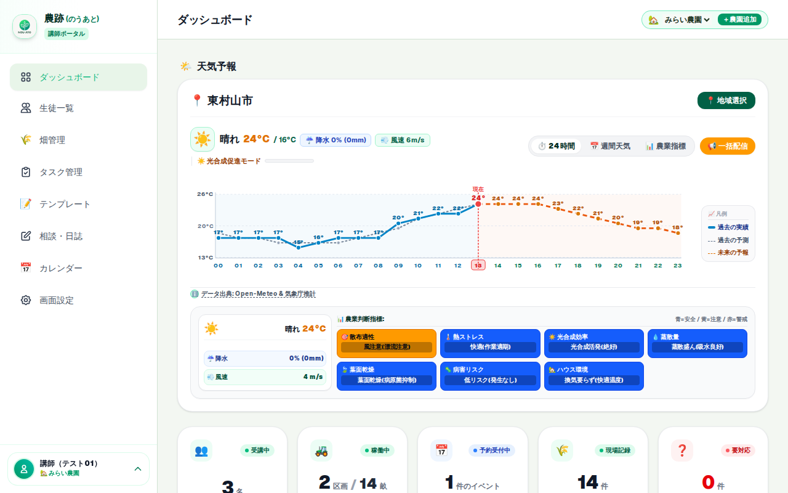
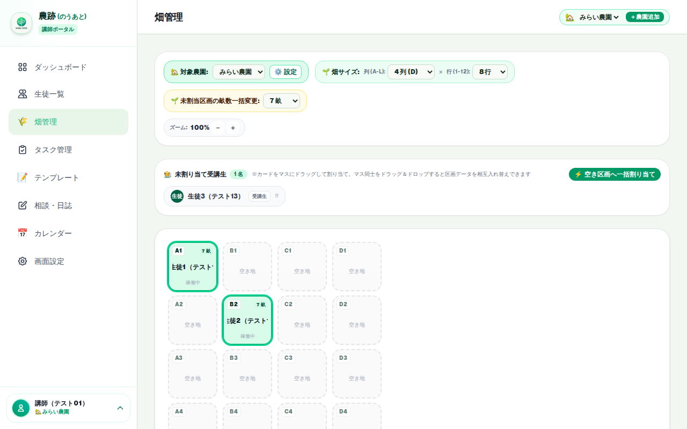
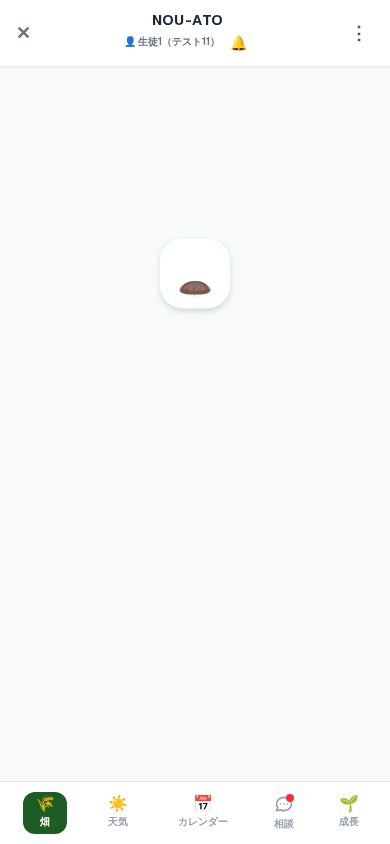
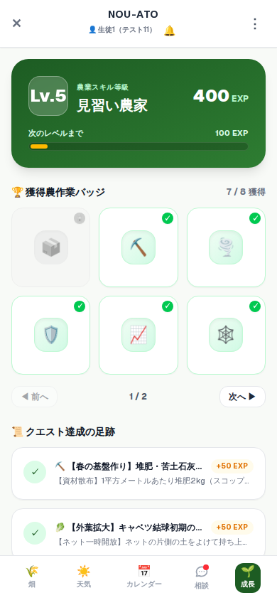

# NOU-ATO (のうあと) - 体験農業経営支援アプリ

「**NOU-ATO（のうあと）**」は、体験農園の運営者（講師）と受講生（生徒）をつなぎ、初心者でも迷わず野菜づくりを楽しみながら学べる体験農業経営支援Webアプリケーションです。

## 📱 アプリケーション画面ギャラリー (UI Screenshots)

### 👨‍🌾 講師向けダッシュボード & 農地マネジメント
| 📊 ダッシュボード概要 | 🚜 農地キャンバス (D&D畝配置) |
| :---: | :---: |
|  |  |
| *受講生進捗、未読日誌、一括アナウンスの一元管理* | *ドラッグ＆ドロップによる畝・作物レイアウト管理* |

### 👨‍🎓 受講生向けモバイルポータル
| 📱 マイファーム & タスクスタック | 🏆 成長スキルボード (3Dバッジ) |
| :---: | :---: |
|  |  |
| *立体カードスタック & 無限循環による快適なタスク消化* | *スロット内3Dコイン回転の達成バッジコレクション* |

> [!TIP]
> 🚀 **本番デプロイURL**: [https://nou-ato.vercel.app](https://nou-ato.vercel.app)  
> 🔑 **ログインURL**: [https://nou-ato.vercel.app/login](https://nou-ato.vercel.app/login)（ログイン画面上に**ワンクリック自動入力ボタン**を完備）

---

## 🚀 デプロイURL & 動作確認用デモアカウント

本アプリケーションは Vercel Edge Network 上に常時デプロイされており、PCおよびスマートフォンのブラウザから即座に動作確認いただけます。

- **本番デプロイURL**: [https://nou-ato.vercel.app](https://nou-ato.vercel.app)
- **ログインURL**: [https://nou-ato.vercel.app/login](https://nou-ato.vercel.app/login)
- **API ドキュメント (Swagger UI)**: [`docs/api-docs.html`](docs/api-docs.html)

### 🔑 動作確認用デモアカウント情報

ログイン画面（[/login](https://nou-ato.vercel.app/login)）の「⚡ ポートフォリオ確認用デモ」枠にあるボタンを押すと、**メールアドレスとパスワードがワンタップで自動入力**されます。手動で入力される場合は以下をご利用ください。

| ロール | メールアドレス | パスワード | 初期リダイレクト | 主な体験可能機能 |
| :--- | :--- | :--- | :--- | :--- |
| **👨‍🌾 講師** | `test01@example.com` | `test01` | `/teacher/dashboard` | ・受講生一覧・ステップ進捗率の把握<br>・農地キャンバス（D&D畝配置・スリム畝カード）<br>・一括アナウンス即時配信<br>・日誌返信 & AIナレッジ化（RAG）承認<br>・農園設定（相談タブON/OFF切り替え） |
| **👨‍🎓 受講生** | `test11@example.com` | `test11` | `/student` | ・マイファーム（ミニトマト栽培・進捗75%）<br>・マイタスク（立体カードスタック & 無限循環ループ）<br>・成長スキルボード（スロット内3Dコイン回転バッジ）<br>・AIしるべぇ相談（チケット制・Yes/No共有トグル）<br>・24時間お天気予報・農園交換日記 |

```text
【クイックコピペ用】
・講師:   test01@example.com / test01
・受講生: test11@example.com / test11
```

---

## 🌾 プロジェクト概要・特徴

- **受講生向け機能 (Student Portal)**:
  - **マイタスク管理 & 進捗可視化**: 栽培ステップ（土作り、苗植え、芽かき、追肥、収穫など）を段階的にクリア。立体的**カードスタック & 無限循環ループ**UIで快適にタスクをブラウズ・写真付き完了報告。
  - **成長スキルボード (3Dバッジコレクション)**: クリアしたタスクに応じてスロット内で**3Dコイン回転する達成バッジ**を獲得。タップでタスク名と詳細を一覧確認。
  - **お天気 & 農園情報 (24h初期展開)**: 畑のピンポイント天気・降水確率・気温を常時把握。
  - **農園交換日記（日誌報告）**: 作業報告や写真を投稿し、講師からの個別アドバイスを受信。
  - **AI相棒「しるべぇ」相談**: 農園の蓄積ノウハウ（RAG）を活用し、自然栽培のコツをいつでも相談（1日3回チケット制・深夜0時自動復活・講師からの追加チケット付与対応・サーバー側多層防御完備）。**個人情報（PII）の自動サニタイズ**と**農園共有許可 (Yes/No)** トグルによる多層プライバシー保護完備。

- **講師向け機能 (Teacher Dashboard)**:
  - **受講生・区画マネジメント**: 受講生ごとの進捗率、割り当て畝、未読日誌を一元把握。
  - **一括アナウンス配信**: 天候不良や収穫イベントの連絡を受講生全員へ即時配信。
  - **農地キャンバス（畝・区画管理）**: ドラッグ＆ドロップ（@dnd-kit）で畝の栽培状況をグラフィカルに管理。畝ナンバーと作物名に集約したスリムな畝カード設計。

---

## 🛠️ 技術スタック

| レイヤー | 採用技術 |
| :--- | :--- |
| **フロントエンド** | Next.js 16 (App Router), React 19, TypeScript |
| **スタイリング** | Tailwind CSS v4, Lucide Icons |
| **状態管理・D&D** | Zustand, @dnd-kit (Core, Sortable, Modifiers) |
| **バックエンド / DB** | Supabase (PostgreSQL, Supabase Auth, SSR, Storage, RLS) |
| **AI / RAG** | Google AI Studio (Gemini 1.5 Flash-Lite / `gemini-flash-lite-latest`), 農園ナレッジ類似度照合エンジン |
| **API アーキテクチャ** | OpenAPI 3.1, RFC 7807 (Problem Details), Swagger UI |
| **CI / CD** | GitHub Actions (Lint, Typecheck, Test, Coverage, Build) |
| **テストフレームワーク** | Vitest, @vitest/coverage-v8 (閾値 70% 準拠) |

---

## 🌐 外部連携API / サービス一覧

本アプリケーションでは、リアルタイム気象データ、位置情報変換、AI対話、SNS認証等の機能提供のため、以下の外部APIおよびクラウドサービスを利用しています。

| サービス名 | 用途 | 呼び出し箇所 | APIキー要否 | 利用規約 / レート制限 |
| :--- | :--- | :--- | :--- | :--- |
| **Google AI Studio (Gemini API)** | AIアシスタント「しるべぇ」のRAG栽培相談・自動回答生成 | `lib/rag/qaKnowledgeRetriever.ts`<br>`app/api/chat/rag/route.ts` | **要** (`GEMINI_API_KEY`) | 15 RPM / 1,500 RPD (Free Tier)<br>※環境変数 `GEMINI_MODEL` (既定: `gemini-flash-lite-latest`) および自動カスケードに対応 |
| **Open-Meteo Forecast API** | ピンポイント農園天気・24時間予報・降水確率・気温・風速・UV予測データの取得 | `components/ui/WeatherWidget.tsx` | **不要** | 10,000 リクエスト/日 (非商用・開発利用無料) |
| **Open-Meteo Geocoding API** | 地名・市区町村キーワード検索による経度・緯度特定 | `components/ui/WeatherWidget.tsx` | **不要** | Open-Meteo API Terms 準拠 |
| **OpenStreetMap Nominatim API** | GPS現在位置（緯度・経度）からの逆ジオコーディング（市区町村名・住所の取得） | `components/ui/WeatherWidget.tsx` | **不要** | 最大 1 リクエスト/秒 (User-Agent 必須) |
| **Supabase (Auth / DB / Storage / Realtime)** | ユーザー認証、PostgreSQLデータベース、観察写真ストレージ、リアルタイム同期 | `lib/supabase.ts`<br>API Routes / 各コンポーネント | **要** (`NEXT_PUBLIC_SUPABASE_URL`<br>`NEXT_PUBLIC_SUPABASE_ANON_KEY`) | Supabase Terms of Service (Free Tier) |
| **LINE Login (Supabase OAuth)** | LINE アカウントを用いたワンタップソーシャルログイン認証 | `app/login/page.tsx` | **要** (Supabase DashboardでのLINE Channel設定) | LINE Developers Terms of Service |

---

## 🚀 環境構築 & ローカル起動手順

### 1. 前提条件
- Node.js `v20` 以上 (推奨: `v24` 以上)
- npm `v10` 以上
- Supabase アカウント (新規プロジェクト作成用)

### 2. リポジトリのクローンと依存関係インストール
```bash
git clone <repository-url>
cd nou-ato
npm install
```

### 3. Supabase プロジェクトの初期セットアップ (DB & Storage)

ゼロから新規の Supabase 環境を構築する場合は、以下の手順でデータベーススキーマの適用と Storage バケットの設定を行います。

#### A. データベースマイグレーションの実行 (DB Schema)
Supabase CLI を利用する方法、または Supabase Dashboard の SQL Editor を利用する方法のいずれかでマイグレーションを適用します。

##### 方法1: Supabase CLI を使う場合（推奨）
```bash
# 1. Supabase CLI にログイン
npx supabase login

# 2. プロジェクトにリンク (YOUR_PROJECT_REF は Supabase ダッシュボード URL または Settings > General から取得)
npx supabase link --project-ref <YOUR_PROJECT_REF>

# 3. マイグレーションファイルを適用
npx supabase db push
```

##### 方法2: Supabase Dashboard (SQL Editor) を使う場合
1. Supabase Dashboard にログインし、対象プロジェクトを選択します。
2. 左メニューの **SQL Editor** を開きます。
3. 以下の順序で `supabase/migrations/` 配下の SQL ファイル内容を貼り付けて実行 (**Run**) します：
   - **1st**: `supabase/migrations/00000000000000_initial_schema.sql` (テーブル、RLS、RPC関数、初期デモデータの作成)
   - **2nd**: `supabase/migrations/20260925_database_integrity_and_sync.sql` (外部キー制約、整合性トリガー、マイファーム同期ビュー)

---

#### B. Storage バケット (`journals`) の作成と公開設定
日誌投稿時の写真アップロードに必要な `journals` ストレージバケットを作成します。

##### 手順:
1. Supabase Dashboard の左メニューから **Storage** を選択します。
2. **New bucket** ボタンをクリックし、以下の設定でバケットを作成します：
   - **Bucket name**: `journals`
   - **Public bucket**: **ON** (有効化: 投稿された画像URLの公開アクセスのため)
3. バケット作成後、認証済みユーザーが画像をアップロードできるように RLS ポリシー（Policies）を設定します：
   - **SELECT**: `Public` (全員読み取り可能)
   - **INSERT / UPDATE**: `Authenticated users` (ログイン済みユーザーのみアップロード可能)
   - *（※ `00000000000000_initial_schema.sql` を適用済みの場合は Storage RLS ポリシーも自動設定されます）*

---

### 4. 環境変数の設定
プロジェクトルートに `.env.local` を作成し、必要なキーを設定します：
```env
# Supabase (Dashboard > Project Settings > API から取得)
NEXT_PUBLIC_SUPABASE_URL=https://your-project.supabase.co
NEXT_PUBLIC_SUPABASE_ANON_KEY=your-anon-key

# Google AI Studio (Gemini API Key)
GEMINI_API_KEY=your-gemini-api-key
GEMINI_MODEL=gemini-flash-lite-latest # (任意: 未指定時は gemini-flash-lite-latest を優先使用)
```

### 5. 開発サーバーの起動
```bash
npm run dev
```
ブラウザで [http://localhost:3000](http://localhost:3000) を開きます。

---

## 🧪 テスト・品質検証コマンド

本プロジェクトでは品質とセキュリティを担保するため、CI/CD連動のテストスイート（全16テストファイル / 103項目全件PASS）を配備しています。

```bash
# 1. 自動テストの実行 (全103件・100%通過)
npm run test

# 2. テストカバレッジ検証 (目標値 70% 判定 / 実績 88%以上達成)
npm run test:coverage

# 3. TypeScript 型チェック (型エラー0件の検証)
npx tsc --noEmit

# 4. 本番ビルド検証 (Turbopack)
npm run build

# 5. コードスタイル・Lint検証
npm run lint
```

---

## 🗺️ 今後の実装予定機能ロードマップ (Roadmap)

今後のアップデートで以下の機能拡充を予定しています：

1. **💳 Stripe オンライン決済・サブスクリプション連携**:
   - 農園受講料の月額引き落とし、追加AI相談チケット・体験イベント参加費の即時クレジットカード決済。
2. **📲 LINE 公式アカウント Push 通知連携**:
   - 講師からの一括お知らせ配信や、明日の水やりアラート、講師からの日誌返信通知をLINEトーク画面へ即時Push。
3. **📶 PWA (Progressive Web App) & オフライン対応**:
   - 電波の届きにくい畑の現場でも、Service Worker と IndexedDB を用いてオフラインで作業記録や写真を一時保存・電波復旧時に自動同期。
4. **🌡️ IoT 農業環境センサー連携**:
   - 土壌水分量、地温、日照センサーデータをリアルタイム収集し、AIしるべぇが「本日水やりが必要か」を自動判定してアドバイス。

---

## 📂 ディレクトリ構成

```text
nou-ato/
├── .github/              # GitHub Actions CI/CD パイプライン
│   └── workflows/        # ci.yml (品質ゲート), deploy.yml (ビルド検証)
├── app/                  # Next.js App Router (ルーティング & API)
│   ├── api/              # API Route Handlers (chat, settings)
│   ├── student/          # 受講生ポータル画面 (畑/天気/予約/相談/成長)
│   ├── teacher/          # 講師ダッシュボード画面 (概要/タスク/生徒/日誌/設定)
│   └── login/            # 認証・ログイン画面
├── components/           # UIコンポーネント (teacher, student, ui, board)
├── lib/                  # 共通ユーティリティ (RAG, Supabase, TicketManager, logger, apiResponse)
├── test/                 # 自動テストスイート (Vitest: 16ファイル・全103項目)
├── docs/                 # 仕様書・品質ダッシュボード・OpenAPI・ER図
└── types/                # TypeScript型定義 (Database, Supabase)
```

---

## 📑 プロジェクト仕様書・ドキュメント一覧

ブラウザで直接開いて確認・操作できるインタラクティブなHTMLダッシュボード群およびMarkdown仕様書群です。全ドキュメントの上部に**統一ナビゲーションバー**が備わっており、1クリックで相互移動できます。

### 1. 📊 インタラクティブ設計＆検証ダッシュボード (HTML)

| ドキュメント | ファイルパス | 内容・役割 |
| :--- | :--- | :--- |
| **オリアプレビュー項目DB (全101項目)** | [`docs/review-checklist-dashboard.html`](docs/review-checklist-dashboard.html) | 全101機能・非機能要件の検証ダッシュボード、合否判定、エビデンス集約 |
| **API 仕様書 & Swagger UI** | [`docs/api-docs.html`](docs/api-docs.html) | OpenAPI 3.1 仕様に基づくブラウザ対話型 API ドキュメント・実行サンドボックス |
| **ER図 & テーブル定義書** | [`docs/database-design.html`](docs/database-design.html) | Mermaid ER図、全8テーブルのカラム型・制約・RLSポリシー設計書 |
| **品質検査計画書 (QA Master Plan)** | [`docs/test-plan.html`](docs/test-plan.html) | 全テスト項目と完全同期したテスト計画、自動テスト実行・カバレッジ検証 |
| **アーキテクチャ & データフロー** | [`docs/architecture-map.html`](docs/architecture-map.html) | Next.js 16 + Supabase + Gemini RAG + RLS 認可フロー構造図 |
| **エージェント & スキル活用ガイド** | [`docs/agent-and-skills-guide.html`](docs/agent-and-skills-guide.html) | AI開発エージェントチームの役割分担と自律修正プロトコル解説 |
| **全画面フロー & 仕様マップ** | [`public/screen_flow.html`](public/screen_flow.html) | 講師・受講生の全画面遷移、機能、データ連携使い方完全マップ |

### 2. 📑 要件定義＆設計仕様書 (Markdown / ブラウザ統合ビューア)

ブラウザ上で美しく読める [**仕様書統合ビューア (docs/markdown-viewer.html)**](docs/markdown-viewer.html) からも全仕様書をワンクリックで閲覧できます。

| ドキュメント | ビューアで閲覧 | 生ファイル | 内容・役割 |
| :--- | :--- | :--- | :--- |
| **要件定義書 (PRD)** | [ブラウザで開く](docs/markdown-viewer.html?doc=prd) | [`PRD.md`](PRD.md) | プロダクト要求仕様書、ユーザーストーリー、機能要件一覧 |
| **非機能要件定義書** | [ブラウザで開く](docs/markdown-viewer.html?doc=nfr) | [`docs/NON_FUNCTIONAL_REQUIREMENTS.md`](docs/NON_FUNCTIONAL_REQUIREMENTS.md) | パフォーマンスSLO、可用性99.9%、セキュリティRLS監査規準 |
| **セキュリティ & コスト防衛ランブック** | [ブラウザで開く](docs/markdown-viewer.html?doc=sec) | [`docs/SECURITY_RUNBOOK.md`](docs/SECURITY_RUNBOOK.md) | GCP 予算アラート設定、Gemini API Quota 上限、緊急キルスイッチ運用 |
| **ログ設計書** | [ブラウザで開く](docs/markdown-viewer.html?doc=log) | [`docs/LOGGING_DESIGN.md`](docs/LOGGING_DESIGN.md) | RFC 7807 統一エラー、機密マスキング、Supabase監査ログ |
| **データベース設計書 (ERD)** | [ブラウザで開く](docs/markdown-viewer.html?doc=erd) | [`docs/ERD.md`](docs/ERD.md) | スキーマ設計、テーブルリレーション、インデックス設計 |
| **API cURLサンプル集** | [ブラウザで開く](docs/markdown-viewer.html?doc=curl) | [`docs/API_CURL_SAMPLES.md`](docs/API_CURL_SAMPLES.md) | 各エンドポイントへのリクエスト例・レスポンス定義 |
| **エージェント運用規定** | [ブラウザで開く](docs/markdown-viewer.html?doc=agents) | [`AGENTS.md`](AGENTS.md) | AI開発エージェント規約、自律型セルフコレクション規定 |
