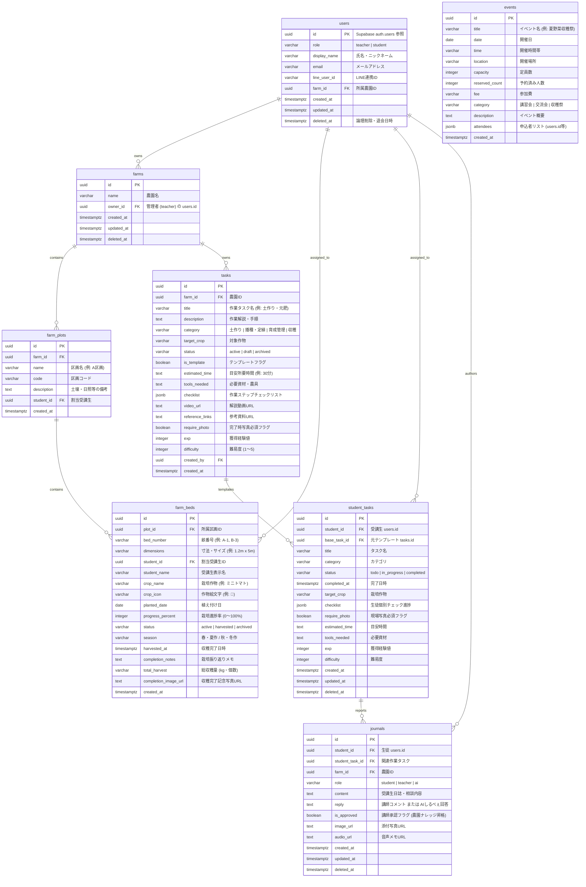

# NOU-ATO (のうあと) データベース ER図 & スキーマ仕様

体験農業経営支援アプリ「NOU-ATO」の PostgreSQL / Supabase リレーショナルデータベース設計仕様書です。

---

## 1. 概念・物理 ER 図 (Entity Relationship Diagram)

---

## 2. Row Level Security (RLS) ポリシー方針

| テーブル | 受講生 (student) 権限 | 講師 (teacher) 権限 | サービスロール |
| :--- | :--- | :--- | :--- |
| **users** | 自身のアカウントのみ SELECT / UPDATE | 同一農園内の全受講生 SELECT / UPDATE / DELETE | ALL |
| **farms** | 所属農園のみ SELECT | 自身が所有する農園の ALL | ALL |
| **farm_plots** | 所属農園内の区画を SELECT | 同一農園内の区画の ALL | ALL |
| **farm_beds** | 自身の割当畝を SELECT / UPDATE | 農園内の全畝の ALL | ALL |
| **tasks** | 公開テンプレートを SELECT | 農園内のタスクテンプレート ALL | ALL |
| **student_tasks** | 自身のタスクのみ SELECT / UPDATE | 農園内受講生のタスク ALL | ALL |
| **journals** | 自身の日誌の SELECT / INSERT / UPDATE | 全生徒の日誌 SELECT / 返信 UPDATE / 承認 | ALL |
| **events** | 公開イベントの SELECT / 参加申込 UPDATE | イベント作成・更新・削除 ALL | ALL |
