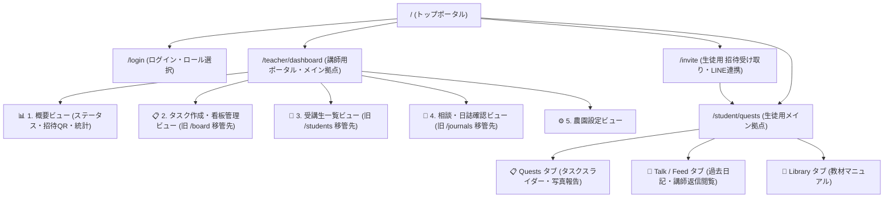

# 画面構造・親子関係・サイトマップ図 (NOU-ATO Site Structure)

本ドキュメントは『のうあと（NOU-ATO）』の画面親子関係、画面遷移リンク、および機能集約された最新のルーティング構造を記録したドキュメントです。

---

## 🌳 1. 全体画面ツリー・親子構造図 (Mermaid)

---

## 👨‍🌾 2. 講師関係 (Teacher Domain)

**メインアクセスURL**: `/teacher/dashboard` (PC/タブレット最適化)

| ビュー / モーダル名 | 機能概要 | 関連アクション / リンク |
| :--- | :--- | :--- |
| **📊 概要 (Overview)** | 農園全体のステータス、受講生数、未回答質問数の把握 | ・招待リンクコピー＆QRコード表示モーダル ・各カードから「受講生一覧」「日誌確認」「タスク作成」へジャンプ |
| **📋 タスク作成・看板管理 (Tasks)** | 旧 `/board` の移管先。D&D（@dnd-kit）による教材プール・予習・公開中管理 | ・`＋ タスクを追加` フォーム展開 ・`TaskEditModal`（難易度・EXP設定） ・`TrashModal`（ゴミ箱・復元・永久削除） |
| **👥 受講生一覧 (Students)** | 旧 `/students` の移管先。登録生徒の進行状況、区画、進捗率 | ・LINE通知リマインド送信 ・未読/遅延フィルター |
| **📝 相談・日誌確認 (Journals)** | 旧 `/journals` の移管先。生徒の現場写真報告・日記確認 | ・アドバイス返信機能 (Supabase保存) ・`★ AIナレッジ化（承認）` (RAG用 `is_approved` 保存) |
| **⚙️ 農園設定 (Settings)** | 農園基本情報、代表者情報、LINE Messaging APIステータス設定 | ・農園設定UPDATE保存 |

---

## 🧑‍🌾 3. 生徒関係 (Student Domain)

**招待拠点URL**: `/invite?farm_id=xxx`  
**メインアクセスURL**: `/student/quests` (スマホ最適化)

| ビュー / モーダル名 | 機能概要 | 関連アクション / リンク |
| :--- | :--- | :--- |
| **🟢 招待受け取り (/invite)** | LINE招待リンクから開くワンタップ登録画面 | ・LINEでサインアップ (プロフィール読み込み) ・農園に参加して始める ➔ `/student/quests` へ遷移 |
| **📋 Quests タブ** | 本日の作業タスク確認・写真撮影報告・日記入力 | ・`TaskSlider` (横スワイプ課題切り替え) ・`TaskDetailModel` (作業手順モーダル) ・写真プレビュー & 作業完了報告 (Supabase保存) |
| **💬 Talk / Feed タブ** | 過去に提出した日記と講師からの返信一覧 | ・`JournalSlider` (過去の記録・アドバイス閲覧) |
| **📖 Library タブ** | 農園の作業マニュアル・教材一覧 | ・春野菜マニュアル・病害虫ガイドの閲覧 |

---

## 🌐 4. その他共通・ポータル (Common Domain)

| ページURL | 目的 | 主要導線 |
| :--- | :--- | :--- |
| **`/` (トップポータル)** | アクセス時のメイン玄関 | ・中央特大ヒーロー「講師ログイン / 生徒LINE参加」 ・下部ダイレクトカードリンク集 |
| **`/login` (ログイン)** | 講師・生徒の権限選択＆ログイン | ・講師ログイン ➔ `/teacher/dashboard` ・ワンタップデモ体験 |

---

## 🧹 5. 整理・削除完了した不要ページ一覧

機能統合に伴い、以下の旧重複ページを安全に削除整理しました：

1. `app/board/page.tsx` ➔ `/teacher/dashboard` の「タスク作成」タブへ完全移管済みのため削除
2. `app/students/page.tsx` ➔ `/teacher/dashboard` の「受講生一覧」タブへ完全移管済みのため削除
3. `app/journals/page.tsx` ➔ `/teacher/dashboard` の「相談・日誌確認」タブへ完全移管済みのため削除
4. `app/templates/page.tsx` ➔ 未使用テンプレートのため削除
