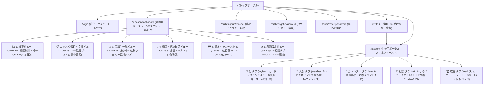

# 画面構造・親子関係・サイトマップ図 (NOU-ATO Site Structure)

本ドキュメントは『のうあと（NOU-ATO）』の画面親子関係、画面遷移リンク、および機能集約された最新のルーティング構造・コンポーネント構成を記録した公式設計書です。

---

## 🌳 1. 全体画面ツリー・親子構造図 (Mermaid)

```mermaid
graph TD
    Root["/ (トップポータル)"]

    %% 認証・登録系
    Root --> Login["/login (統合ログイン・ロール切替)"]
    Root --> Invite["/invite (生徒用 招待受け取り・登録)"]
    Root --> SignupT["/auth/signup/teacher (講師アカウント開設)"]
    Root --> Forgot["/auth/forgot-password (PWリセット申請)"]
    Root --> Reset["/auth/reset-password (新PW設定)"]

    %% 講師領域 (Teacher Domain)
    Root --> TeacherDash["/teacher/dashboard (講師用ポータル・PC/タブレット最適化)"]
    TeacherDash --> TView1["📊 1. 概要ビュー (Overview: 農園統計・招待QR・未対応日誌)"]
    TeacherDash --> TView2["📋 2. タスク管理・看板ビュー (Tasks: D&D教材プール・公開中管理)"]
    TeacherDash --> TView3["👥 3. 受講生一覧ビュー (Students: 進捗率・畝割り当て・個別タスク)"]
    TeacherDash --> TView4["📝 4. 相談・日誌確認ビュー (Journals: 返信・AIナレッジ化承認)"]
    TeacherDash --> TView5["🗺️ 5. 農地キャンバスビュー (Canvas: 畝配置D&D・スリム畝カード)"]
    TeacherDash --> TView6["⚙️ 6. 農園設定ビュー (Settings: AI相談タブON/OFF・LINE連携)"]

    %% 生徒領域 (Student Domain)
    Invite --> StudentPortal["/student (生徒用ポータル・スマホファースト)"]
    Root --> StudentPortal
    StudentPortal --> STab1["🌱 畑 タブ (myfarm: カードスタックタスク・写真報告・スリム畝日誌)"]
    StudentPortal --> STab2["⛅ 天気 タブ (weather: 24hピンポイント気象予報・一括アナウンス)"]
    StudentPortal --> STab3["📅 カレンダー タブ (events: 農園講習・収穫イベント予約)"]
    StudentPortal --> STab4["🤖 相談 タブ (talk: AIしるべぇ・チケット制・PII保護・Yes/No共有)"]
    StudentPortal --> STab5["🏆 成長 タブ (feed: スキルボード・スロット内3Dコイン回転バッジ)"]
```

---

## 👨‍🌾 2. 講師関係 (Teacher Domain)

**メインアクセスURL**: `/teacher/dashboard` (レスポンシブ / PC・タブレット最適化)

| ビュー / モーダル名                 | 機能概要                                                             | 関連コンポーネント & アクション                                                                                                         |
| :---------------------------------- | :------------------------------------------------------------------- | :-------------------------------------------------------------------------------------------------------------------------------------- |
| **📊 概要 (Overview)**              | 農園全体のステータス、受講生数、未読日誌、今日のアナウンスの把握     | ・`TeacherOverviewView` ・招待リンクコピー＆QRコード表示モーダル ・未読日誌・受講生一覧へのショートカット                         |
| **📋 タスク作成・看板管理 (Tasks)** | 教材プール・予習課題・公開中タスクのD&D操作（@dnd-kit）              | ・`TeacherKanbanView` ・`TaskEditModal`（タイトル、難易度、獲得EXP、作業手順、画像登録） ・`TrashModal`（ゴミ箱・復元・完全削除） |
| **👥 受講生一覧 (Students)**        | 受講生の栽培作物、ステップ進捗率、未読日誌、個別タスク割当           | ・`TeacherStudentsView` ・受講生ステータスフィルター ・個別タスク割当モーダル（`AssignModal`）                                    |
| **📝 相談・日誌確認 (Journals)**    | 生徒からの写真付き作業日記の確認と個別アドバイス返信                 | ・`TeacherJournalsView` ・講師アドバイス返信送信（リアルタイムDB同期） ・`★ AIナレッジ承認`（RAG参照用ナレッジとして承認登録）    |
| **🗺️ 農地キャンバス (Canvas)**      | 農園の畝配置（グリッド・D&D）、受講生割り当て、栽培ステータス管理    | ・`TeacherCanvasView` ・畝番号と作物名に集約したスリムな畝カード設計（縦幅圧縮） ・空き畝／栽培中／収穫完了ステータス更新         |
| **⚙️ 農園設定 (Settings)**          | 農園基本情報、受講生ポータルの「AI相談」タブ表示ON/OFF、LINE API設定 | ・`TeacherSettingsView` ・`/api/settings` RESTful 設定同期 ・安全な設定保存とトースト通知                                         |

---

## 🧑‍🌾 3. 生徒関係 (Student Domain)

**招待拠点URL**: `/invite?farm_id=xxx`  
**メインアクセスURL**: `/student` (スマホファースト / ボトムナビゲーション)

| タブ / モーダル名                 | 機能概要                                                  | 関連コンポーネント & 最新仕様                                                                                                                                                                                                                                       |
| :-------------------------------- | :-------------------------------------------------------- | :------------------------------------------------------------------------------------------------------------------------------------------------------------------------------------------------------------------------------------------------------------------ |
| **🟢 招待受け取り (`/invite`)**   | 招待リンクからワンタップで農園に参加・生徒登録            | ・受講生アカウント作成 & 農園初期紐付け ・登録完了後 `/student` へ即時自動遷移                                                                                                                                                                                   |
| **🌱 畑 タブ (`myfarm`)**         | 本日の作業タスク確認・写真撮影報告・現場気づきメモ        | ・`TaskSlider`: 立体的**カードスタック & 無限循環ループ**UI（スワイプで次カードが前面へ遷移、一周で先頭復帰） ・`TaskDetailModal`: 作業手順・ポイントのモーダル確認 ・`StudentFarmRecordView`: 畝番号・作物名に最適化されたカード表示、日誌・写真アップロード |
| **⛅ 天気 タブ (`weather`)**      | 畑のピンポイント気象情報と講師からの一括連絡確認          | ・`WeatherWidget`: 24時間気温・降水確率・風速の初期展開表示 ・講師からの緊急一括アナウンス（雨天中止等）のリアルタイム表示                                                                                                                                       |
| **📅 カレンダー タブ (`events`)** | 農園イベント、収穫体験、講習会の予約とスケジュール確認    | ・`EventCalendar`: 月別カレンダー & 直近イベントリスト ・ワンタップ予約・キャンセル処理                                                                                                                                                                          |
| **🤖 相談 タブ (`talk`)**         | 自然栽培AI相棒「しるべぇ」との対話相談（RAGナレッジ連携） | ・`StudentTalkView`: 1日3回チケット制（日付変更で自動3回復活、秘密の呪文対応） ・多層プライバシー保護: **個人情報（PII）自動マスキング** ・**共有許可 (Yes/No)** トグルボタン（農園ナレッジ蓄積の可否を明示選択）                                             |
| **🏆 成長 タブ (`feed`)**         | クリアした課題の実績・獲得スキルバッジのコレクション      | ・`StudentSkillBoardView`: 達成バッジグリッド ・**スロット内3Dコイン回転アニメーション**（Y軸回転） ・タップ展開による名称・クリアタスク一覧のテキスト表示カード                                                                                              |
| **🔔 お知らせモーダル**           | 講師からの一括アナウンス履歴の一覧確認                    | ・ヘッダーベルアイコンから展開、未読バッジ連動、ローカル既読管理                                                                                                                                                                                                    |
| **👤 アカウントメニュー**         | プロフィール情報確認・ダークテーマ切替・安全なログアウト  | ・画面外タップ検知で自動クローズ                                                                                                                                                                                                                                    |

---

## 🌐 4. 認証・共通ポータル (Auth & Common Domain)

| ページURL                   | 目的                             | 主要導線                                                                                                                      |
| :-------------------------- | :------------------------------- | :---------------------------------------------------------------------------------------------------------------------------- |
| **`/` (トップポータル)**    | アクセス時のメイン玄関・機能紹介 | ・「講師としてログイン」「受講生として体験」 ・デモアカウント情報案内                                                      |
| **`/login` (統合ログイン)** | 講師・受講生のロール別ログイン   | ・Supabase Auth 認証（JWTセッション） ・ログイン完了後のロール別自動リダイレクト（`/teacher/dashboard` または `/student`） |
| **`/auth/signup/teacher`**  | 講師用アカウント新規開設         | ・農園名・講師名・認証情報登録                                                                                                |
| **`/auth/forgot-password`** | パスワード再設定メール申請       | ・Supabase Auth リセットメール送信                                                                                            |
| **`/auth/reset-password`**  | パスワード再設定実行画面         | ・トークン検証・新パスワード更新                                                                                              |
| **`/auth/callback`**        | OAuth / メール認証コールバック   | ・セッション確立・リダイレクト制御                                                                                            |

---

## 🧹 5. 整理・最適化完了したルーティング一覧

機能集約・リファクタリングに伴い、以下の旧画面は単一ポータルへ統合・整理されました：

1. `app/board/page.tsx` ➔ `/teacher/dashboard`（Tasksタブ）へ完全集約
2. `app/students/page.tsx` ➔ `/teacher/dashboard`（Studentsタブ）へ完全集約
3. `app/journals/page.tsx` ➔ `/teacher/dashboard`（Journalsタブ）へ完全集約
4. `app/student/quests/page.tsx` ➔ `/student` への自動リダイレクトへ移行し、単一ポータル化
